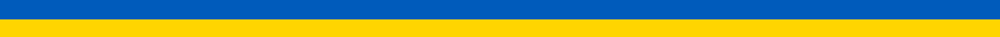
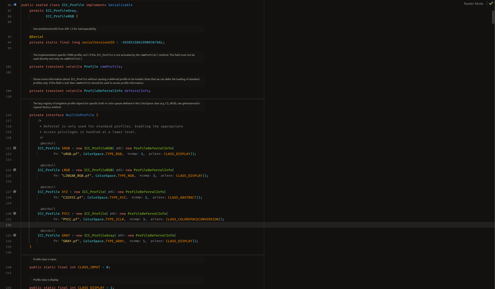

# Hiberbee Theme

*Hiberbee Theme is a Visual Studio (2022) extension with Hiberbee dark theme*

Vivid, color-intensive dark theme for Visual Studio IDE with consolidated color code for all programming languages.
Features:
Unique color identity map for all language elements and constructs
Design is available and maintained in Figma [template](https://www.figma.com/file/2oyhOnKUdLZCDQEkH2klNT/Hiberbee-Theme) color palette

----

Support the Armed Forces of Ukraine and People Affected by Russia’s Aggression on UNITED24, the official fundraising platform of Ukraine: https://u24.gov.ua.

**Слава Україні!**

## Download Latest Version

The latest stable version can be downloaded from the VisualStudio [marketplace](https://marketplace.visualstudio.com/items?itemName=SergiyEgoshyn.HiberbeeTheme) page, or get the newest one manually directly from this sources.

# Build

**The recommended way to get the program is BUILD from source**
- Install git, Visual Studio (2022 or higher)
- `git clone https://github.com/sergiye/hiberbeeTheme.git`
- build

----

### How To Use

It's very simple:
 - Download the latest version of extension from releases (or Visual Studio marketplace)(.vsix file).
 - Install the extension for your Visual Studio 2022.
 - Follow: **Tools > Theme > Hiberbee**.
 - Enjoy

That's it, the installation is complete!

#### Color Scheme

### Font

You may have noticed that the font does not match the original one. To solve this issue, you need to [download](https://www.jetbrains.com/lp/mono/) and install fonts from the official JetBrains website.

Also, after choosing a theme, follow the path:

**Tools > Options > Environment > Fonts and Colors**.

In the Font field, select one of the JetBrains fonts (I highly recommend JetBrains Mono)

----

## License

This is free software: you can redistribute it under the terms of the GNU General Public License as published by the Free Software Foundation, either version 3 of the License, or (at your option) any later version.

This program is distributed in the hope that it will be useful, but WITHOUT ANY WARRANTY; without even the implied warranty of MERCHANTABILITY or FITNESS FOR A PARTICULAR PURPOSE.  See the GNU General Public License for more details.

You should have received a copy of the GNU General Public License  along with this program.  If not, see http://www.gnu.org/licenses/.

## Conclusion

Initially, I did this theme extension for myself and as an experiment and did not really count on any result, but now I hope that I have enough time and energy to support and develop it.

Thank you for installing and have a nice day!

## Donate

**If you like the program, you can support the author and transfer money to**
- Card number: 5169 3600 1644 3834 (https://easypay.ua/moneytransfer/transfer2card?id=99445709)
- IBAN number: UA113052990000026208909644481

OR you can support Ukraine any way you like it ;)